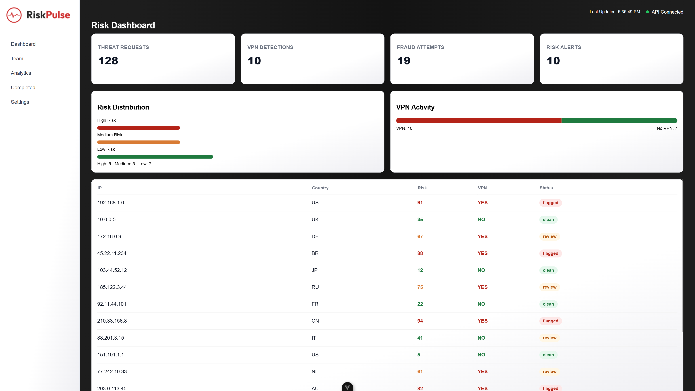

# RiskPulse

Demo Real-time risk dashboard for monitoring IP threat signals, VPN usage, and fraud risk scoring.

## Overview

RiskPulse is a full-stack demo dashboard that visualizes simulated security risk data including:

- Threat request volume
- VPN detection rates
- Fraud attempts
- Risk scoring per IP address

Frontend:
- Vue 3 (Composition API)
- Vanilla CSS (custom dashboard styling)

Backend:
- Go (net/http)
- JSON API

Hosting:
- Frontend: Vercel
- Backend: Railway

## Features

- Live dashboard UI with API polling
- Risk classification (low / medium / high)
- Responsive layout
- Animated cards and charts
- Clean dark SaaS-style UI

## Architecture

Vue frontend fetches data from a Go REST API:

Frontend (Vercel)
  ↓ fetch()
Backend (Railway Go API)
  ↓
Static JSON risk dataset

## Preview

## Live Preview

https://riskpulse-theta.vercel.app/